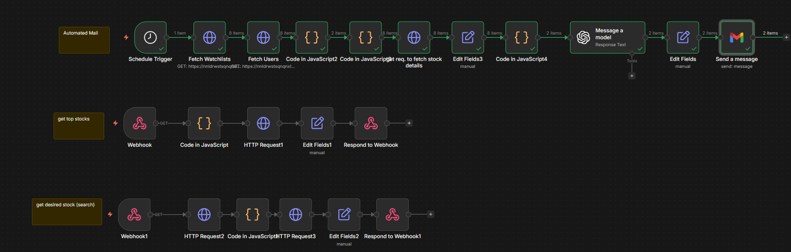

# StockTrack

StockTrack is a simple stock watchlist web app. It lets a user sign up, log in, browse/search stocks, add stocks to a personal watchlist, remove them later, and get a daily stock summary by email.



The frontend is a static site; stock data and email summaries are served by the FastAPI backend in `backend/`.

## What It Uses

- `frontend/auth.html` for login and signup
- `frontend/index.html` for the dashboard
- `frontend/style.css` for the UI
- `frontend/script.js` for auth, stock loading, search, and watchlist actions
- Supabase for authentication and storing each user's watchlist
- Python (FastAPI) as the backend layer for stock data and daily email summaries

## Backend

The backend is handled by a Python **FastAPI** server, replacing the original n8n setup.

The backend handles:
- Fetching top stocks via `yfinance`
- Searching stocks via `yfinance`
- Running a daily 9 AM summary cron job via `apscheduler`
- Sending the watchlist summary email via `smtplib`

The frontend calls these FastAPI endpoints:
- `GET /top-stocks`: Fetches details of top stock symbols.
- `GET /search-stock?q=<symbol>`: Searches for a specific stock symbol.

The expected stock response is a list of stocks with:
- `symbol`
- `price`
- `previousClose`


## Authentication

Authentication is done with Supabase Auth.

Users can:

- create an account with email and password
- log in with email and password
- log out from the dashboard

The app checks the current Supabase user when the page loads:

- logged-in users who open `auth.html` are sent to `index.html`
- logged-out users who open `index.html` are sent back to `auth.html`

## Watchlist Storage

Watchlist data is stored in Supabase in a `watchlists` table.

The app expects the table to store:

- the user's Supabase id
- the stock symbol added by that user

In the frontend this is handled with:

- `user_id`
- `stock_symbol`

Each user only sees and manages their own watchlist.

## Main Features

- Email/password signup and login
- Protected dashboard page
- Top stocks list loaded from FastAPI backend
- Stock search with debounce
- Add stocks to watchlist
- Remove stocks from watchlist
- Watchlist saved in Supabase
- Daily 9 AM email summary powered by FastAPI backend scheduler
- Responsive dark UI

## How The Flow Works

1. User signs up or logs in from `auth.html`.
2. Supabase handles the auth session.
3. After login, the user goes to `index.html`.
4. The dashboard loads the user's saved watchlist from Supabase.
5. The top stocks list is fetched from the FastAPI backend.
6. Search also goes through the FastAPI backend.
7. Adding or removing a stock updates the Supabase watchlist table.
8. The FastAPI scheduler runs daily at 9:00 AM to send email summaries.


## Running & Deploying

### Frontend
1. The frontend is a static site. Open `auth.html` directly in a browser or serve it using a simple HTTP server (e.g. `npx serve frontend`).
2. **For deployment:** Host the static files (e.g. on GitHub Pages, Netlify, or Vercel). In `frontend/script.js`, change the fallback in `BACKEND_URL` to point to your deployed backend URL.

### Backend
1. **Install Dependencies:**
   ```bash
   pip install -r backend/requirements.txt
   ```
2. **Configure Environment Variables:**
   Copy `backend/.env.example` to `backend/.env` and fill in your values (or set them in your hosting platform like Render, Railway, or Fly.io). Stock endpoints work without Supabase; email summaries require all SMTP and Supabase variables.
   - `SUPABASE_URL`: Your Supabase Project URL.
   - `SUPABASE_KEY`: Your Supabase Anon/Publishable Key.
   - `SUPABASE_SERVICE_ROLE_KEY`: Your Supabase Service Role Key (needed to query user email addresses for daily summaries).
   - `SMTP_SERVER`: e.g. `smtp.gmail.com`
   - `SMTP_PORT`: e.g. `587`
   - `SMTP_EMAIL`: Your Gmail email address.
   - `SMTP_PASSWORD`: Your Gmail App Password.
3. **Run Locally:**
   ```bash
   python backend/main.py
   ```
   The backend will run on `http://localhost:8000`.


## Machine Learning Features

The project now includes a machine learning module for stock price prediction.

### How it works:
1. **Symbol list**: `ml/symbols.py` defines ~50 US tickers and ~45 Indian NSE tickers (`.NS`). Edit this file to add more symbols, then retrain.
2. **Data Generation**: `ml/generate_data.py` fetches 2 years of history for every symbol in that list via `yfinance`.
3. **Model Training**: `ml/train_model.py` trains one Random Forest with symbol encoding so India and US prices are handled separately.
4. **Prediction**: One batch run forecasts **all** trained symbols at once (no per-stock CLI args).

Training on *every* listed stock in India and the US is not practical (thousands of tickers). The default list covers major Nifty and US large-cap names; extend `ml/symbols.py` as needed.

### How to run:
1. **Generate Data**:
   ```bash
   python ml/generate_data.py
   ```
2. **Train Model** (also runs batch predictions when finished):
   ```bash
   python ml/train_model.py
   ```
3. **Predict all stocks** (writes `ml/predictions.csv` and `ml/predictions.json`):
   ```bash
   python ml/predict.py
   ```

**API:** `GET http://localhost:8000/predictions` returns forecasts for all trained symbols in one response.

Note: This is a demonstration of ML workflow and should not be used for actual financial decisions.


